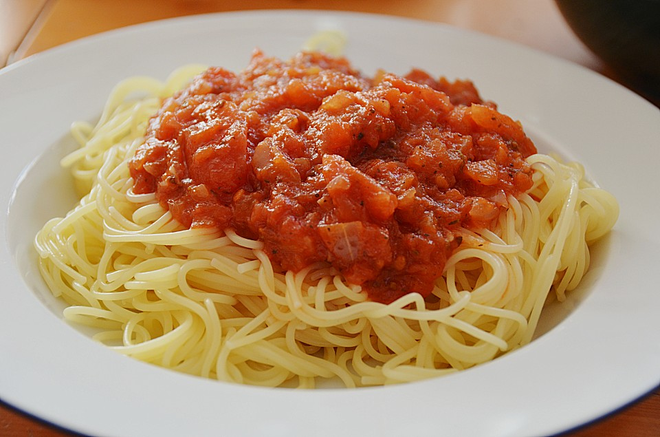
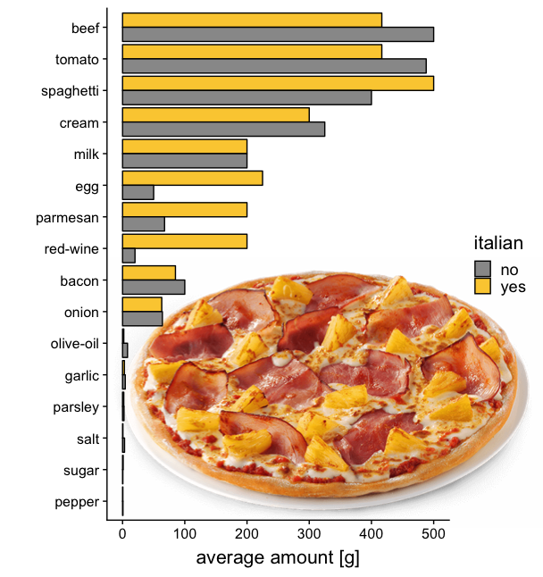
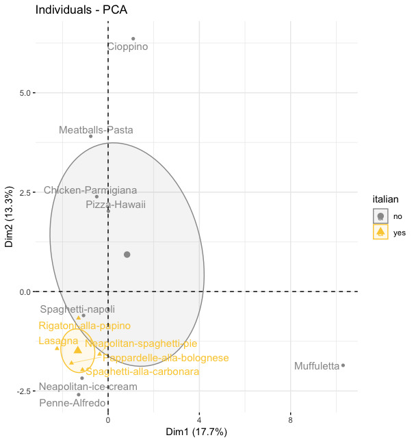
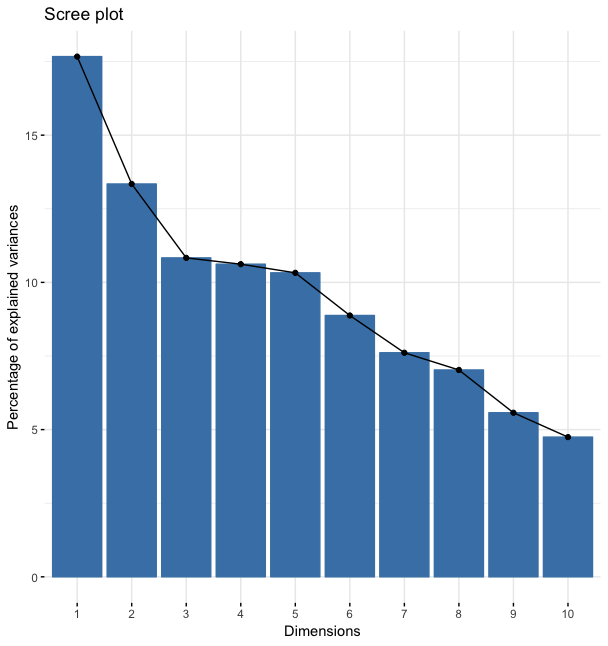

# The mystery of true-italian and pseudo-italian recipes

## aim
We tried to understand the differences between true-italian and pseudo-italian recipes.  

## analyses
Based on expert knowledge of which recipe is true-italian and which is pseudo-italian we tried to find the ***italian-factor***.
Prototype pseudo-italian recipes include `Spaghetti Napoli`, `Penne Alfredo`, `Meatballs-Pasta` and `Pizza Hawaii`.
The analyses are based on a [tidy list](recipe-ingredients.csv) of selected recipes, their ingredients and amounts.  

### looking at average ingredient-amounts
The average ingredient-amount of all ingredients which are present in at least one true- and one pseudo-italian recipe were compared:  

There is no clear ***italian-factor*** apparent.  
But small differences were visible. Amongst others, Pseudo-italian recipes seem to contain a bit more beef, more tomatoes and a bit less spaghetti.

### PCA
Using PCA, we hoped to find two clusters containing the true- and pseudo-italian recipes.

There is a cluster of true-italian recipes.

But the problem is highly complex, as the eigenvalues/variances of dimensions show:

## summary
A clear ***italian-factor*** still remains a mystery. We failed to find a defining factor with the applied methods.

## outlook
If one would find the ***italian-factor***, which defines a true-italian recipe, one could make predictions for any unknown recipe based on the ingredients/amounts.

## acknowledgements
We thank ozagordi for his continuous support and advice in conducting this study.

## author contributions
[sschmutz](https://github.com/sschmutz), [vkufne](https://github.com/vkufne) and [mihuber](https://github.com/mihuber) collected the data; sschmutz analyzed the data and wrote the manuscript; vkufne and mihuber reviewed and approved the manuscript.
